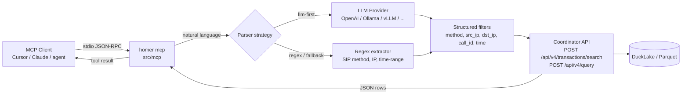

# MCP Module — Model Context Protocol

The MCP module exposes Homer Core as an [MCP](https://modelcontextprotocol.io/) server so that LLM clients (Cursor, Claude Desktop, OpenCode, custom agents, …) can search HEP data using natural language.

It is built on top of [`mark3labs/mcp-go`](https://github.com/mark3labs/mcp-go) and lives in [`src/mcp/`](../src/mcp/).

## Table of Contents

1. [Overview](#1-overview)
2. [Architecture](#2-architecture)
3. [Tools](#3-tools)
4. [NL Parser strategies](#4-nl-parser-strategies)
5. [Configuration](#5-configuration)
6. [Running](#6-running)
7. [MCP client setup](#7-mcp-client-setup)
8. [Response shape and meta diagnostics](#8-response-shape-and-meta-diagnostics)
9. [HTTP API for the UI](#9-http-api-for-the-ui)
10. [Example queries](#10-example-queries)
11. [Security](#11-security)
12. [Troubleshooting](#12-troubleshooting)
13. [Related documents](#13-related-documents)

---

## 1. Overview

| Capability | Detail |
|------------|--------|
| Transport | stdio (current); the `mcp-go` lib also supports SSE / streamable-HTTP if needed later |
| Backend | Homer Core Coordinator HTTP API (`/api/v4/transactions/search`, `/api/v4/query`) |
| NL parsing | Deterministic regex parser, optionally augmented by an OpenAI-compatible LLM |
| Tools | `homer_search_transactions`, `homer_query_sql`, `homer_query` |
| Read-only | Yes — SQL validator blocks anything except `SELECT` / `WITH` against `homer_lake.main.hep_proto_1_call` |

The module is entirely opt-in: it ships disabled by default (`mcp.enable=false`).

## 2. Architecture



Key files:

- [`src/mcp/mcp.go`](../src/mcp/mcp.go) — module lifecycle, MCP tools, regex parser, structured payload builder, SQL builder + validator, HTTP client to the Coordinator.
- [`src/mcp/llm.go`](../src/mcp/llm.go) — `LLMClient`, an OpenAI-compatible chat-completions client. Reused verbatim by the Coordinator HTTP handler so stdio MCP and the UI's AI tab share **one** LLM code path.
- [`src/mcp/mcp_test.go`](../src/mcp/mcp_test.go), [`src/mcp/llm_test.go`](../src/mcp/llm_test.go), [`src/coordinator/handlers/mcp_llm_test.go`](../src/coordinator/handlers/mcp_llm_test.go) — unit tests.
- [`src/coordinator/handlers/mcp_llm.go`](../src/coordinator/handlers/mcp_llm.go), [`src/coordinator/handlers/transactions_v4.go`](../src/coordinator/handlers/transactions_v4.go) — HTTP handlers for `POST /api/v4/mcp/query` and `GET /api/v4/mcp/llm/status`. They consume `mcp.LLMClient` via `SearchHandler.llm`.
- [`src/main.go`](../src/main.go) — `runMCPSubcommand` (registered as `homer mcp`).
- [`src/config/config.go`](../src/config/config.go) — `MCPConfig` and `MCPLLMConfig` structs.

> **Single LLM client, two transports.** Before unification the Coordinator carried its own duplicate of the chat-completions client which required `api_key != ""` and `provider == "openai"`. Both gates have been removed: any OpenAI-compatible endpoint (Ollama, vLLM, LM Studio, OpenRouter, Groq, …) now works for both the stdio MCP server and the UI's AI tab.

## 3. Tools

The server registers three tools.

### `homer_search_transactions`

Structured search: NL → field filters → `POST /api/v4/transactions/search`.

| Argument | Type | Required | Description |
|----------|------|----------|-------------|
| `query_text` | string | yes | Natural language query |
| `now_utc_unix_ms` | int64 | no | Override current time (mostly for tests / offline LLMs) |
| `limit` | int | no | 1..1000, defaults to `mcp.default_limit` |
| `parser` | string | no | `auto` (default), `llm`, `regex` |

### `homer_query_sql`

Generates and executes a safe `SELECT` against the call table:

`SELECT * FROM homer_lake.main.hep_proto_1_call WHERE … ORDER BY timestamp DESC LIMIT N`

| Argument | Type | Required | Description |
|----------|------|----------|-------------|
| `query_text` | string | yes | Natural language query |
| `limit` | int | no | 1..50000, defaults to `mcp.sql_default_limit` |
| `parser` | string | no | `auto` (default), `llm`, `regex` |

The generated SQL is returned in the response (`generated_sql`) and is server-side validated:

- only `SELECT` / `WITH` allowed
- semicolons forbidden
- only `homer_lake.main.hep_proto_1_call` allowed
- forbidden tokens: `insert`, `update`, `delete`, `drop`, `alter`, `truncate`, `copy`, `attach`, `detach`, `call`, `create`, `grant`, `revoke`

### `homer_query`

Hybrid: defaults to `homer_search_transactions`, switches to `homer_query_sql` when the query text explicitly asks for it (`mode=sql`, `sql:`, `show sql`, `display sql`, `print sql`, `raw sql`).

| Argument | Type | Required | Description |
|----------|------|----------|-------------|
| `query_text` | string | yes | Natural language query |
| `mode` | string | no | `auto` (default), `structured`, `sql` |
| `now_utc_unix_ms` | int64 | no | Override current time |
| `limit` | int | no | Max rows |
| `parser` | string | no | `auto` (default), `llm`, `regex` |

The global `mcp.mode` setting can pin the module to `structured` or `sql`, in which case the per-request `mode` argument is ignored.

## 4. NL Parser strategies

Two backends, controlled per-request via the `parser` argument.

### Regex (always available)

Defined in [`src/mcp/mcp.go`](../src/mcp/mcp.go) (`buildStructuredPayload`, `extractSIPMethod`, `extractPattern`, `parseTimeRange`).

Recognises:

- SIP methods: `INVITE`, `BYE`, `REGISTER`, `OPTIONS`, `ACK`, `CANCEL`, `PRACK`, `UPDATE`, `INFO`, `REFER`, `SUBSCRIBE`, `NOTIFY`, `PUBLISH`, `MESSAGE`
- IP addresses: `src ip <ip>`, `source ip <ip>`, `dst ip <ip>`, `destination ip <ip>`
- Call ID: `call-id <id>`, `call_id <id>`, `session-id <id>`
- Users: `from_user <u>`, `caller <u>`, `to_user <u>`, `callee <u>`
- Time: `last hour`, `today` / `heute`, `yesterday` / `gestern` (default = last hour)

Pure Go, zero dependencies, deterministic.

### LLM (optional)

Defined in [`src/mcp/llm.go`](../src/mcp/llm.go). One thin OpenAI-compatible client that posts to `<base_url>/chat/completions` with `response_format=json_object` and asks the model to emit a strict JSON envelope:

```json
{
  "method":           "INVITE | BYE | ...",
  "src_ip":           "...",
  "dst_ip":           "...",
  "call_id":          "...",
  "from_user":        "...",
  "to_user":          "...",
  "time_range_label": "last_hour | today | yesterday | custom | ...",
  "from_ms":          1700000000000,
  "to_ms":            1700003600000
}
```

All fields are optional — anything the model omits is filled in by the regex parser as a fallback during merge.

### Strategies

| `parser` value | Behavior |
|----------------|----------|
| `auto` (default) | LLM-first if `mcp.llm.enable=true`, automatic regex fallback on any LLM error (timeout, HTTP 5xx, invalid JSON, …) |
| `llm` | Force LLM, return tool error if LLM is disabled or fails |
| `regex` | Force regex, never call LLM |

The fallback path is also logged on the server: `MCP LLM parse failed, falling back to regex error=<reason>` (level `warn`).

## 5. Configuration

Add an `mcp` section to `homer-core.json`:

```json
{
  "mcp": {
    "enable": true,
    "mode": "hybrid",
    "homer_base_url": "http://127.0.0.1:8080",
    "homer_token": "replace-with-jwt",
    "default_limit": 100,
    "sql_default_limit": 100,
    "request_timeout_sec": 30,
    "llm": {
      "enable": false,
      "provider": "openai",
      "base_url": "https://api.openai.com/v1",
      "api_key": "",
      "model": "gpt-4o-mini",
      "temperature": 0.1,
      "max_tokens": 400,
      "timeout_sec": 15
    }
  }
}
```

### Top-level `mcp.*`

| Field | Default | Description |
|-------|---------|-------------|
| `enable` | `false` | Start MCP module on `homer` boot when modular server runs |
| `mode` | `hybrid` | Global mode: `hybrid`, `structured`, `sql` |
| `homer_base_url` | `http://127.0.0.1:8080` | Coordinator base URL |
| `homer_token` | `""` | Bearer JWT used by MCP HTTP calls (required) |
| `default_limit` | `100` | Default row limit for structured mode (capped at 1000) |
| `sql_default_limit` | `100` | Default row limit for SQL mode (capped at 50000) |
| `request_timeout_sec` | `30` | HTTP timeout to Coordinator |

### `mcp.llm.*`

| Field | Default | Description |
|-------|---------|-------------|
| `enable` | `false` | Turn on LLM-first parsing |
| `provider` | `openai` | Reserved for future native clients; today any non-empty value is treated as OpenAI-compatible |
| `base_url` | `https://api.openai.com/v1` | OpenAI-compatible chat completions root |
| `api_key` | `""` | Sent as `Authorization: Bearer <key>` only when non-empty (so Ollama works without it) |
| `model` | `gpt-4o-mini` | Model name passed to the provider |
| `temperature` | `0.1` | Lower = more deterministic JSON |
| `max_tokens` | `400` | Cap on response length |
| `timeout_sec` | `15` | HTTP timeout for LLM calls |

### Provider examples

**OpenAI:**

```json
"llm": {
  "enable": true,
  "base_url": "https://api.openai.com/v1",
  "api_key": "sk-...",
  "model": "gpt-4o-mini"
}
```

**Local Ollama** (no API key required):

```json
"llm": {
  "enable": true,
  "base_url": "http://localhost:11434/v1",
  "api_key": "",
  "model": "llama3.1"
}
```

**vLLM:**

```json
"llm": {
  "enable": true,
  "base_url": "http://vllm-host:8000/v1",
  "api_key": "",
  "model": "Qwen/Qwen2.5-7B-Instruct"
}
```

**LM Studio:**

```json
"llm": {
  "enable": true,
  "base_url": "http://localhost:1234/v1",
  "api_key": "",
  "model": "qwen2.5-7b-instruct"
}
```

**OpenRouter / Groq / Together / DeepInfra / …** — same shape, just point `base_url` at their `/v1` endpoint and provide `api_key`.

## 6. Running

### A) As part of the modular server

```bash
./homer --config-path /etc/homer-core/homer-core.json
```

When `mcp.enable=true`, the module registers itself alongside `ingest`, `storage`, `node`, `coordinator`. In this mode the stdio MCP server is started under the same process — typically used for embedded experiments.

### B) Dedicated stdio process (typical for desktop MCP clients)

```bash
./homer mcp --config-path /etc/homer-core/homer-core.json
```

This is what Cursor / Claude Desktop / OpenCode invoke. The process talks JSON-RPC over stdio.

## 7. MCP client setup

### Cursor

Add to `~/.cursor/mcp.json` (or workspace MCP config):

```json
{
  "mcpServers": {
    "homer-core": {
      "command": "/path/to/homer",
      "args": [
        "mcp",
        "--config-path",
        "/etc/homer-core/homer-core.json"
      ]
    }
  }
}
```

### Claude Desktop

Add to `~/Library/Application Support/Claude/claude_desktop_config.json` (macOS) or the equivalent on Linux/Windows:

```json
{
  "mcpServers": {
    "homer-core": {
      "command": "/path/to/homer",
      "args": ["mcp", "--config-path", "/etc/homer-core/homer-core.json"]
    }
  }
}
```

### Manual smoke test (initialize handshake)

```bash
printf '%s\n' \
  '{"jsonrpc":"2.0","id":1,"method":"initialize","params":{"protocolVersion":"2024-11-05","capabilities":{},"clientInfo":{"name":"smoke","version":"0"}}}' \
  '{"jsonrpc":"2.0","method":"notifications/initialized"}' \
  '{"jsonrpc":"2.0","id":2,"method":"tools/list"}' \
  | ./homer mcp --config-path /etc/homer-core/homer-core.json
```

Expected: a `tools/list` response containing the three tools above.

## 8. Response shape and meta diagnostics

Every tool returns a JSON envelope:

```json
{
  "mode": "structured | sql",
  "normalized_filters": { "...": "..." },
  "api_payload":        { "filter": "...", "param": "...", "timestamp": "..." },
  "generated_sql":      "SELECT ... (only for sql mode)",
  "total":              123,
  "items":              [ { "...": "..." } ],
  "keys":               [ "..." ],
  "meta": {
    "parser_used":    "llm | regex_fallback | regex",
    "llm_model":      "gpt-4o-mini",
    "llm_latency_ms": 412,
    "llm_error":      "(only when fallback occurred)"
  }
}
```

The `meta.parser_used` field always tells the client which path actually produced the filters, even when `parser=auto`. This lets you observe LLM hit/miss rates from the agent side.

## 9. HTTP API for the UI

Beyond stdio, the Coordinator also exposes the MCP query path over HTTP for the UI's `AI` tab. The HTTP path uses the **same** `LLMClient` as the stdio path, so the parser strategies, provider compatibility, and diagnostics are identical.

### `POST /api/v4/mcp/query`

```json
{
  "query_text": "find INVITE messages from the last hour",
  "mode":       "auto",
  "parser":     "auto",
  "limit":      100,
  "timestamp":  { "from": 1740652800000, "to": 1740656400000 },
  "now_utc_unix_ms": 1740656400000
}
```

| Field | Values | Default | Description |
|-------|--------|---------|-------------|
| `query_text` | string | required | Natural language query |
| `mode` | `auto` \| `structured` \| `sql` | `auto` | `auto` switches to `sql` only when the text explicitly requests SQL |
| `parser` | `auto` \| `llm` \| `regex` | `auto` | Same semantics as the stdio `parser` argument (see §4) |
| `limit` | int | mode-dependent (100 / 100) | Max rows. Capped at 1000 (structured) or 50000 (sql) |
| `timestamp.from`/`to` | int64 ms | inferred from text | Explicit time window |
| `now_utc_unix_ms` | int64 ms | `time.Now()` | Override for deterministic LLM tests |

**Error semantics for `parser`:**

| Condition | Status |
|-----------|--------|
| `parser=llm` and LLM disabled | `424 Failed Dependency` |
| `parser=llm` and LLM call errored | `502 Bad Gateway` |
| `parser=auto` and LLM call errored | regex fallback, `200 OK` |
| `parser=regex` | LLM never called, `200 OK` |

**Response `meta.parser`** (added):

```json
{
  "meta": {
    "parser": {
      "used":       "llm | regex_fallback | regex",
      "requested":  "auto | llm | regex",
      "model":      "gpt-4o-mini",
      "latency_ms": 412,
      "error":      "(only when fallback occurred)"
    }
  }
}
```

The UI renders this as a colored chip next to the row count so users can tell at a glance whether the LLM bridge actually answered the query.

### `GET /api/v4/mcp/llm/status?check=true|false`

Returns LLM runtime status; with `check=true` (default) it also pings the provider's `/models` endpoint. Authorization is sent only when `mcp.llm.api_key` is non-empty, so Ollama / vLLM / LM Studio installations without a key still report `reachable: true`.

```json
{
  "data": {
    "enabled":            true,
    "provider":           "ollama",
    "provider_supported": true,
    "base_url":           "http://localhost:11434/v1",
    "model":              "llama3.1",
    "key_configured":     false,
    "checked":            true,
    "reachable":          true,
    "detail":             "ok"
  }
}
```

See [MCP_UI_GUIDE.md](MCP_UI_GUIDE.md) for the UI-side details.

## 10. Example queries

- `find all INVITE messages from the last hour`
- `show sql for INVITE messages for today`
- `find calls from src ip 10.10.0.5`
- `find call-id abc-123 in the last hour`
- `failed REGISTERs from yesterday for user 1001` *(works best with LLM enabled)*
- `show me BYE between 1700000000000 and 1700003600000` *(LLM picks up explicit ranges)*

## 11. Security

- All Coordinator calls go through the standard JWT path — `mcp.homer_token` should be a short-lived service token with the minimum required scope.
- SQL is server-side validated before execution; only `SELECT` / `WITH` against `homer_lake.main.hep_proto_1_call` are allowed (see `validateSQL` in [`src/mcp/mcp.go`](../src/mcp/mcp.go)).
- LLM provider keys live in `mcp.llm.api_key`. Treat the config file as a secret: prefer mounting it from a secrets manager.
- LLM output is **never** trusted as SQL. The model only emits structured filters that the Go side translates into a parameterised payload or a templated `SELECT` that goes through the same validator.
- When `mcp.llm.enable=false` (default) no outbound LLM traffic happens.

## 12. Troubleshooting

| Symptom | Likely cause / fix |
|---------|--------------------|
| `mcp.homer_token is required` | Set a JWT in `mcp.homer_token`. The module refuses to call the Coordinator without one. |
| `mcp.homer_base_url is required` | Set `mcp.homer_base_url` to the Coordinator URL. |
| `parser=llm requested but mcp.llm.enable=false` | Either enable the LLM or drop the per-request `parser=llm`. |
| `llm api error 401` | Wrong / missing `api_key` for the provider. Ollama-style local servers need `api_key=""`. |
| `llm api error 404` | `base_url` points at a host that does not implement the OpenAI-compatible `/chat/completions` route. Append `/v1` if missing. |
| `llm http request failed: ... context deadline exceeded` | Increase `mcp.llm.timeout_sec` or pick a faster model. The fallback will still serve a regex-based answer when `parser=auto`. |
| `decode llm response` / `unmarshal llm filters` | Provider returned non-JSON output. Lower `temperature`, ensure the provider supports `response_format=json_object`, or accept the regex fallback. |
| Empty results for a sane query | Check time range, SIP method spelling, and `meta.parser_used` to see whether LLM/regex is being used. |
| `forbidden SQL token` / `only SELECT/WITH is allowed` | The generated SQL hit the validator. The MCP tool is intentionally read-only. |

Tip: always inspect `meta.parser_used` in tool responses to understand whether you're hitting the LLM path or the regex fallback.

## 13. Related documents

- [MCP_UI_GUIDE.md](MCP_UI_GUIDE.md) — UI integration (`AI` tab in `SearchPanel`) and `/api/v4/mcp/*` HTTP endpoints
- [COORDINATOR.md](COORDINATOR.md) — Coordinator REST API consumed by the MCP module
- [SEARCH.md](SEARCH.md) — `/api/v4/transactions/search` semantics
- [`src/mcp/README.md`](../src/mcp/README.md) — quick package-level reference
- [mark3labs/mcp-go on GitHub](https://github.com/mark3labs/mcp-go) — upstream library
- [Model Context Protocol specification](https://modelcontextprotocol.io/)
