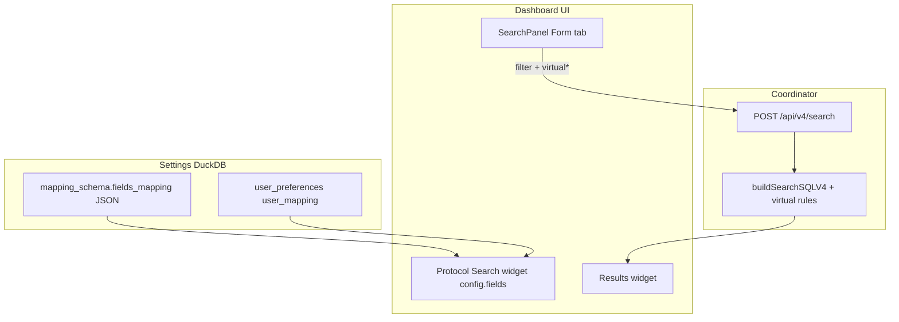

# Search forms: mappings, fields, and virtual filters

This guide explains how **Protocol Search** widgets in Homer 11 get their form fields, how to define them in `mapping_schema`, and how **virtual fields** query JSON inside `data_extra`.

Related:

- Seed examples: [`examples/mappings/`](../examples/mappings/README.md)
- Deep links / URL filters: [SEARCH_URL.md](SEARCH_URL.md)
- Structured search API: `POST /api/v4/search` → `buildSearchSQLV4` in [`transactions_v4.go`](../src/coordinator/handlers/transactions_v4.go)

---

## Architecture (short)



1. **`mapping_schema`** stores one row per protocol (`hepid` + `profile`) with a JSON array **`fields_mapping`**.
2. The search widget loads that array (merged with per-user **`user_mapping`** for order/visibility only).
3. On **Search**, the UI sends `filter` keys matching each field **`id`** (plus `filter.virtual`, `virtual_absent`, `virtual_present` for virtual fields).
4. The coordinator turns known ids into SQL `WHERE` clauses on the DuckLake table (`hep_proto_*`, `otlp_*`, `lp_*`, …).

---

## `mapping_schema` row

| Column | Role |
|--------|------|
| `hepid` | Same integer as `filter.proto_type` in search (e.g. `1` = SIP). |
| `profile` | Same string as `filter.event_type` (e.g. `call`, `registration`, `default`). |
| `hep_alias` | Display label in UI (e.g. `SIP`, `OTLP_TRACES`). |
| `fields_mapping` | **JSON array** of field objects (this document). |
| `fields_settings`, `schema_mapping`, … | Advanced / ingest metadata (usually `{}` for search-only changes). |

**Virtual protocol mappings** (no classic `hep_proto_*` table):

| `hepid` | `profile` | Target table |
|---------|-----------|----------------|
| 200 | `default` | `otlp_traces` |
| 201 | `default` | `otlp_metrics` |
| 202 | `default` | `otlp_logs` |
| 300 | `<measurement>` | `lp_<measurement>` (auto-synced on ingest) |

Seeded SIP example: [`examples/mappings/fields_sip_call.json`](../examples/mappings/fields_sip_call.json).

---

## How to add or change search fields

### 1. Edit `fields_mapping` JSON

Each element is one form control:

```json
{
  "id": "from_user",
  "name": "From user (caller)",
  "type": "string",
  "form_type": "input",
  "position": 3,
  "hide": false
}
```

**Rules:**

- **`id`** — stable key; sent as `filter.<id>` (must match what `buildSearchSQLV4` understands, or use **virtual** for `data_extra` only).
- **`name`** — label in the search form.
- **`position`** — sort order (lower = higher in the form).
- **`hide: true`** — field exists in mapping but is off by default; enable in widget settings (gear icon).
- **`skip: true`** — omitted from the widget entirely.

Keep seeds in sync: [`src/coordinator/services/seeds/`](../src/coordinator/services/seeds/) and [`examples/mappings/`](../examples/mappings/).

### 2. Persist the mapping

- **UI:** Settings → **Mappings** (admin create/update), or widget **Settings** → protocol picker + drag-and-drop field lists.
- **API:** `GET/POST/PUT/DELETE /api/v4/mappings`, `GET /api/v4/mappings/merged`, `GET /api/v4/mappings/widget-fields?hepid=1&profile=call`.

### 3. Wire the search widget

1. Add a **Protocol Search** widget to the dashboard.
2. Open widget settings → choose **HEP alias – profile** (e.g. `SIP - call`).
3. Drag fields between **Available** and **Selected**; save (writes **`user_mapping`** for your user).
4. Pair with a **Results** widget (or set **Results container** in field list).

New widgets without config auto-bootstrap from preset or first SIP `call` mapping ([`SearchPanel.tsx`](../src/ui/src/dashboard/widgets/SearchPanel.tsx)).

### 4. Backend support (non-virtual columns)

For a new **`id`** that maps to a **real table column**, add handling in `buildSearchSQLV4` and extend `SearchObjectV4.Filter` in [`transactions_v4.go`](../src/coordinator/handlers/transactions_v4.go).

If you only add JSON to `fields_mapping` but the coordinator has no branch for that `id`, the UI will send the value but SQL will ignore it.

**Already wired SIP call ids** (non-exhaustive): `call_id`, `session_id`, `cid`, `from_user` / `caller`, `to_user` / `callee`, `method` / `methods`, `response_code` / `response_codes`, `src_ip`, `dst_ip`, `src_port`, `dst_port`, `capture_id`, `node` / `node_id`, `user_agent`, `ruri_user`, `payload`, `cseq_method`, registration: `aor`, `contact`, `expires`, OTLP: `trace_id`, `name`, `service_name`, `type` / `types`, etc.

---

## Field object reference

### Core properties

| Property | Type | Description |
|----------|------|-------------|
| `id` | string | Filter key in API (`filter.<id>`). Use snake_case matching DB or virtual path semantics. |
| `name` | string | Human-readable label in the form. |
| `type` | string | Value shape for UI validation: `string`, `integer`, `int`, `number`, `boolean`. |
| `form_type` | string | Widget control (see table below). |
| `position` | number | Display order. |
| `hide` | boolean | If `true`, hidden until enabled in widget settings. |
| `skip` | boolean | If `true`, never shown in Protocol Search. |
| `selected` | boolean | Optional default-on in widget config snapshot. |
| `index` | string | Index hint: `none`, `secondary`, `primary` (LP `time` uses `primary`). |
| `sid_type` | boolean | Marks primary session/correlation field (bootstrap fallback if nothing selected). |
| `category` | string | Optional grouping (legacy Homer; rarely used in Homer 11 UI). |
| `virtual` | object | Optional; search uses `data_extra` JSON (see below). |

### `form_type` — UI control types

Homer 11 **Protocol Search** (`SearchPanel` Form tab) supports:

| `form_type` | UI control | Notes |
|-------------|------------|--------|
| `input` | Single-line text or number | Default. `type: integer` → `type="number"` input. |
| `input_multi_select` | Multi-select chips + custom values | Uses `form_default` as preset options. Sends `filter.<id>` or `filter.<id>s` (array → SQL `IN`). |
| `multiselect` | Same as above when `selector` or `form_default` is set | Legacy alias; prefer `input_multi_select` in new JSON. |
| `select` | Dropdown | Requires `selector: [{ "name", "value" }, ...]`. |
| `datetime` | `datetime-local` input | Used for LP `time` and time-like columns. |
| `loki-field` | Multiline LogQL textarea | Loki integrations. |
| `switch` | (Line Protocol auto-mappings) | Boolean LP columns from `BuildLPFieldsMapping`. |
| `checkbox` | Intended for virtual absent/present | See **virtual** section; dedicated checkbox UI may still fall back to text until rendered explicitly. |

**Not rendered in Protocol Search Form tab** (other widgets / legacy):

| `form_type` | Where |
|-------------|--------|
| `smart-input` | Homer 7 smart-input widget; Homer 11 **Smart Input** panel is SQL-only. |
| Widget-only ids | `limit`, `results_container` — added by UI, not from `mapping_schema`. |

### `form_default` and `selector`

**`form_default`** — preset options for multi-select:

```json
"form_default": [
  { "name": "INVITE", "value": "INVITE" },
  { "name": "200", "value": "200" }
]
```

**`selector`** — same shape for `form_type: "select"` dropdowns.

Users can still type custom values in `input_multi_select` (chips).

### Per-user layout: `user_mapping`

Saved from widget settings; stored per user keyed by `hepid_profile`.

Only **`selected`** and **`position`** are taken from user overrides. **`name`**, **`form_type`**, **`selector`**, **`virtual`** always come from server **`fields_mapping`** so admin updates propagate.

---

## Virtual fields

Virtual fields search inside the DuckLake **`data_extra`** JSON column instead of a top-level column. They are defined only in **`fields_mapping`**; there is no separate table column.

### `virtual` block

```json
{
  "id": "to_tag",
  "name": "To tag (JSON)",
  "type": "string",
  "form_type": "input",
  "position": 18,
  "hide": true,
  "virtual": {
    "kind": "data_extra_json",
    "path": "to_tag",
    "match": "like"
  }
}
```

| Property | Values | Meaning |
|----------|--------|---------|
| `kind` | `data_extra_json` | Only supported kind today ([`fields_virtual.go`](../src/coordinator/services/fields_virtual.go)). |
| `path` | dotted path, e.g. `to_tag`, `foo.bar` | JSON path under `data_extra` (segments: `[a-zA-Z_][a-zA-Z0-9_]*`). |
| `match` | `like` (default), `equals`, `absent`, `present` | How the value is applied in SQL. |

### `match` modes

| `match` | UI input | API | SQL effect |
|---------|----------|-----|------------|
| `like` | Text | `filter.virtual.<id> = "substring"` | `json_extract(data_extra, '$.path') LIKE '%value%'` |
| `equals` | Text | same | exact match on extracted string |
| `absent` | Checkbox (when enabled) | `filter.virtual_absent: ["<id>"]` | JSON path null, empty, or `'null'` |
| `present` | Checkbox (when enabled) | `filter.virtual_present: ["<id>"]` | path exists and non-empty |

Example absent/present pair (SIP seed):

```json
{
  "id": "no_to_tag",
  "name": "No To-tag (e.g. first INVITE)",
  "form_type": "checkbox",
  "virtual": { "kind": "data_extra_json", "path": "to_tag", "match": "absent" }
},
{
  "id": "has_to_tag",
  "name": "Has To-tag",
  "form_type": "checkbox",
  "virtual": { "kind": "data_extra_json", "path": "to_tag", "match": "present" }
}
```

Virtual rules are loaded for the active `hepid` + `profile` on each search. OTLP (`200`–`202`) and Line Protocol (`300`) skip virtual handling.

Implementation: `VirtualRulesFromFieldsMapping`, `appendVirtualDataExtraConditions`, `appendVirtualAbsentPresentConditions` in coordinator.

---

## Search request shape (Form tab)

```json
{
  "filter": {
    "proto_type": 1,
    "event_type": "call",
    "call_id": "abc@host",
    "from_user": "alice",
    "methods": ["INVITE", "BYE"],
    "virtual": {
      "to_tag": "abc123"
    },
    "virtual_absent": ["no_to_tag"],
    "virtual_present": []
  },
  "param": { "limit": 100 },
  "timestamp": { "from": 1743857605187, "to": 1743858205187 }
}
```

Multi-select with one value uses singular key (`method`); multiple values use plural (`methods`) for SQL `IN (...)`.

---

## SIP field id cheat sheet (`hepid=1`)

| `id` | Column / source | Profile notes |
|------|-----------------|---------------|
| `call_id` | `session_id` (+ `cid` OR in default profile) | `sid_type: true` in call mapping |
| `from_user` | `caller` | call |
| `to_user` | `callee` | call |
| `method` | `method` | multi-select → `IN` |
| `response_code` | `response_code` | multi-select → `IN` |
| `src_ip`, `dst_ip`, `src_port`, `dst_port` | same | |
| `user_agent` | column or `data_extra` | registration vs call |
| `ruri_user` | `data_extra.request_uri` | LIKE |
| `payload` | `payload` | substring |
| `aor`, `contact`, `expires` | registration columns | `profile: registration` |
| `from_tag`, `to_tag` | **virtual** `data_extra` | |

Aliases in API: `caller` ↔ `from_user`, `callee` ↔ `to_user`, `session_id` ↔ `call_id`.

---

## Line Protocol auto-fields

When LP measurements are ingested, the coordinator updates `mapping_schema` via [`lp_mapping_sync.go`](../src/coordinator/services/lp_mapping_sync.go) and [`BuildLPFieldsMapping`](../src/coordinator/services/lp_field_mapping.go):

- DuckDB type → `type` + `form_type` (`datetime`, `switch`, `input`, …).
- Column `time` → `sid_type: true`, `index: primary`.
- Hidden internal columns may get `hide: true`.

No manual JSON file per measurement is required after ingest is enabled.

---

## Checklist: new searchable field

1. Choose **`id`** and whether it is a **column** or **virtual** (`data_extra`).
2. Add object to `fields_mapping` with `name`, `type`, `form_type`, `position`, `hide`.
3. Update mapping via Settings → Mappings or API.
4. In dashboard: configure Protocol Search widget → move field to **Selected**.
5. If column-based: extend `buildSearchSQLV4` / `SearchObjectV4.Filter` if not already supported.
6. Test: `POST /api/v4/search` with `filter.<id>` and confirm SQL in logs or CLI `homer search`.

---

## Troubleshooting

| Symptom | Likely cause |
|---------|----------------|
| Field missing in form | `skip: true`, not in **Selected** in widget settings, or wrong `hepid`/`profile`. |
| Field visible but search ignores it | No SQL branch for that `id`; use virtual or extend backend. |
| Virtual filter no effect | Wrong `hepid`/`profile`; typo in `path`; OTLP/LP proto (virtual disabled). |
| Multi-select ignored | Empty array; check plural key `methods` in network tab. |
| Homer 7 “protosearch” feel missing | Homer 11 uses generic **Protocol Search** + **Results** table; configure mapping + selected fields ([issue #763](https://github.com/sipcapture/homer/issues/763)). |

---

## Files to read in the repo

| Area | Path |
|------|------|
| Field seeds | `src/coordinator/services/seeds/fields_*.json`, `examples/mappings/` |
| Virtual parsing | `src/coordinator/services/fields_virtual.go` |
| Search SQL | `src/coordinator/handlers/transactions_v4.go` (`buildSearchSQLV4`, virtual appenders) |
| UI form builder | `src/ui/src/dashboard/widgets/SearchPanel.tsx` |
| Widget field editor | `src/ui/src/dashboard/components/SearchWidgetSettings.tsx`, `DragDropFieldList.tsx` |
| Merged mappings hook | `src/ui/src/hooks/useMappings.ts` |
